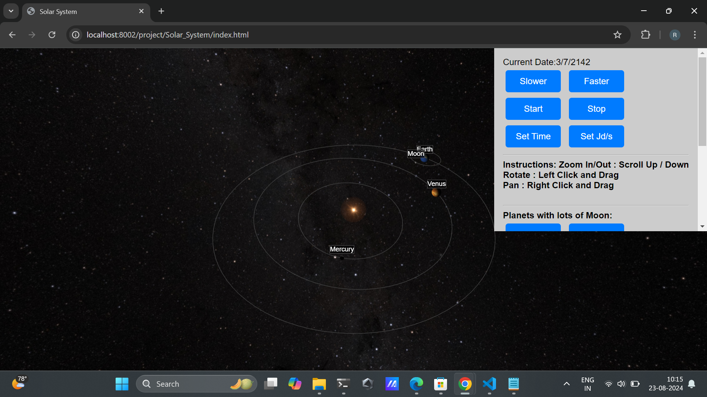

# Universe

git clone universe :
```bash
git clone https://github.com/sidXpro/Universe.git
cd universe
```
Run following command to start the server:
```bash
	python test_server.py 8001
```

change the port number if its busy

Make sure the landing page must be as same as figure provided "Landing Page.png"
must have npm and python installed


